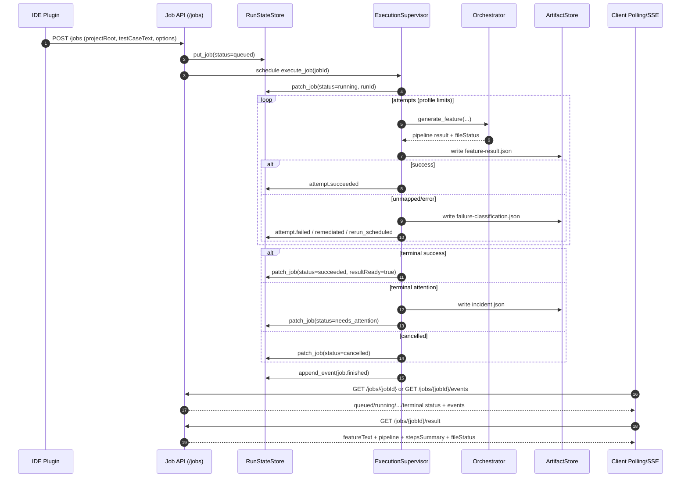

# agent-service

`agent-service` - backend-сервис на FastAPI для плагина `Агентум` (IntelliJ Platform/Sber IDE).
Сервис отвечает за:
- индексацию Cucumber-шагов проекта;
- генерацию `.feature` (основной поток `jobs-first`);
- чат-контролплейн с SSE, статусами и подтверждениями действий;
- вспомогательные tool/memory endpoint'ы.

Документация по плагину: `ide-plugin/README.md`.

## Состав репозитория

- `src` - backend-код (`api`, `agents`, `chat`, `self_healing`, `infrastructure`).
- `tests` - тесты API, оркестратора, matcher'а, startup и интеграций.
- `ide-plugin` - код IntelliJ-плагина, который работает с этим backend.
- `.agent` - локальные данные runtime (индексы шагов, артефакты запусков).

## Архитектура

```text
IntelliJ/Sber IDE Plugin
  -> agent-service (FastAPI, {AGENT_SERVICE_API_PREFIX}/*)
    -> Orchestrator (parse -> match -> feature_build)
      -> local stores (steps index, learning, artifacts)
      -> Jira testcase provider (stub/live/disabled)
      -> LLM/GigaChat adapter (+ corp proxy mode)
```

## Требования

- Python `>=3.10`
- PowerShell (для команд ниже) или любой shell с эквивалентными командами

## Быстрый старт

```powershell
python -m venv .venv
.\.venv\Scripts\Activate.ps1
python -m pip install --upgrade pip setuptools
python -m pip install -e .
```

Запуск:

```powershell
agent-service
```

Альтернативно:

```powershell
$env:PYTHONPATH="src"
python -m app.main
```

Проверка состояния:

```powershell
curl http://127.0.0.1:8000/health
```

Важно:
- пока startup-инициализация не завершена, `/health` возвращает `503` и `status=initializing`;
- после успешной инициализации возвращается `200` и `status=ok`.

## Базовый URL API

Все route'ы ниже публикуются с префиксом `AGENT_SERVICE_API_PREFIX` (по умолчанию `/api/v1`).
Пример: `POST /jobs` фактически доступен как `/api/v1/jobs`.

## Обзор API

### Steps API

- `POST /steps/scan-steps`
- `GET /steps/?projectRoot=...`

Назначение:
- сканирование проекта и построение/обновление индекса шагов;
- чтение сохраненного индекса шагов.

### Feature API (legacy synchronous)

- `POST /feature/generate-feature`
- `POST /feature/apply-feature`

Назначение:
- синхронная генерация feature;
- запись feature в файл.

Примечание: для генерации в плагине основной путь - `jobs-first`. `feature/*` сохранен для прямых вызовов и совместимости.

### Jobs API (рекомендуемый путь для генерации)

- `POST /jobs`
- `GET /jobs/{jobId}`
- `GET /jobs/{jobId}/attempts`
- `GET /jobs/{jobId}/result`
- `POST /jobs/{jobId}/cancel`
- `GET /jobs/{jobId}/events` (SSE)

Назначение:
- асинхронный lifecycle генерации;
- ретраи/самовосстановление на уровне попыток;
- получение результата и артефактов/инцидентов.

### Chat API

- `POST /chat/sessions`
- `GET /chat/sessions`
- `POST /chat/sessions/{sessionId}/messages`
- `POST /chat/sessions/{sessionId}/tool-decisions`
- `GET /chat/sessions/{sessionId}/history`
- `GET /chat/sessions/{sessionId}/status`
- `GET /chat/sessions/{sessionId}/diff`
- `POST /chat/sessions/{sessionId}/commands`
- `GET /chat/sessions/{sessionId}/stream` (SSE)

Назначение:
- control-plane API для IDE-чата;
- хранение истории/статуса/диффа;
- подтверждения действий агента (`approve_once`, `approve_always`, `reject`).

### Tools / Memory / LLM

- `POST /tools/find-steps`
- `POST /tools/compose-autotest`
- `POST /tools/explain-unmapped`
- `POST /memory/feedback`
- `POST /llm/test`

## Jobs-first поток генерации

Основная последовательность:
1. `POST /jobs` с `projectRoot`, `testCaseText` и опциями.
2. Ожидание завершения: polling `GET /jobs/{jobId}` или SSE `GET /jobs/{jobId}/events`.
3. Получение результата: `GET /jobs/{jobId}/result`.

### Диаграмма пайплайна (sequenceDiagram)



Минимальный пример:

```powershell
# 1) создать job
curl -X POST http://127.0.0.1:8000/api/v1/jobs `
  -H "Content-Type: application/json" `
  -d "{\"projectRoot\":\"C:/work/project\",\"testCaseText\":\"Given ...\",\"source\":\"ide-plugin\",\"profile\":\"quick\"}"

# 2) смотреть статус
curl http://127.0.0.1:8000/api/v1/jobs/{jobId}

# 3) забрать итог
curl http://127.0.0.1:8000/api/v1/jobs/{jobId}/result
```

### Lifecycle job

- типовой путь: `queued -> running -> succeeded | needs_attention | cancelled`
- при отмене может быть промежуточный `cancelling`
- если результат еще не готов, `GET /jobs/{jobId}/result` возвращает `409`

### Attempt-level статусы

Внутри job попытки могут иметь статусы:
- `started`
- `succeeded`
- `failed`
- `remediated`
- `rerun_scheduled`
- `cancelled`

### Профили выполнения

В `ExecutionSupervisor` заданы профили:
- `quick` - быстрый режим (меньше автоповторов и меньше лимит времени)
- `strict` - более строгий режим
- `ci` - максимальные лимиты для CI-пайплайна

### Идемпотентность `POST /jobs`

Поддерживается заголовок `Idempotency-Key`:
- тот же ключ + тот же payload -> вернется существующий `jobId`;
- тот же ключ + другой payload -> `409`.

## Сканирование шагов и качество матчей

- перед генерацией рекомендуется запускать `POST /steps/scan-steps`;
- jobs-пайплайн сам сканирование не запускает;
- без актуального индекса выше вероятность `unmapped` и `match`-статуса `needs_scan`.

## Jira source mode

`AGENT_SERVICE_JIRA_SOURCE_MODE`:
- `stub` - использовать локальные stub-данные;
- `live` - ходить в реальный Jira;
- `disabled` - не резолвить Jira testcase ключи.

## Конфигурация (переменные окружения)

### Базовые

| Переменная | По умолчанию | Назначение |
| --- | --- | --- |
| `AGENT_SERVICE_APP_NAME` | `agent-service` | Имя сервиса |
| `AGENT_SERVICE_API_PREFIX` | `/api/v1` | Префикс API |
| `AGENT_SERVICE_HOST` | `127.0.0.1` | Host bind |
| `AGENT_SERVICE_PORT` | `8000` | Port bind |
| `AGENT_SERVICE_LOG_REQUEST_BODIES` | `false` | Логировать body входящих запросов для диагностики |
| `AGENT_SERVICE_STEPS_INDEX_DIR` | `.agent/steps_index` | Путь к индексу шагов |
| `AGENT_SERVICE_ARTIFACTS_DIR` | `.agent/artifacts` | Путь к artifacts jobs |

### Jira / testcase source

| Переменная | По умолчанию | Назначение |
| --- | --- | --- |
| `AGENT_SERVICE_JIRA_SOURCE_MODE` | `stub` | Режим источника testcase (`stub/live/disabled`) |
| `AGENT_SERVICE_JIRA_REQUEST_TIMEOUT_S` | `20` | HTTP timeout к Jira |
| `AGENT_SERVICE_JIRA_DEFAULT_INSTANCE` | `https://jira.sberbank.ru` | Jira instance по умолчанию |
| `AGENT_SERVICE_JIRA_VERIFY_SSL` | `true` | Проверка TLS Jira |
| `AGENT_SERVICE_JIRA_CA_BUNDLE_FILE` | `null` | Кастомный CA bundle для Jira |

### LLM общие

| Переменная | По умолчанию | Назначение |
| --- | --- | --- |
| `AGENT_SERVICE_LLM_ENDPOINT` | `null` | Endpoint внешнего LLM |
| `AGENT_SERVICE_LLM_API_KEY` | `null` | API ключ внешнего LLM |
| `AGENT_SERVICE_LLM_MODEL` | `null` | Имя модели внешнего LLM |
| `AGENT_SERVICE_LLM_API_VERSION` | `null` | Версия API внешнего LLM |

### GigaChat

| Переменная | По умолчанию | Назначение |
| --- | --- | --- |
| `GIGACHAT_CLIENT_ID` / `AGENT_SERVICE_GIGACHAT_CLIENT_ID` | `null` | OAuth client id |
| `GIGACHAT_CLIENT_SECRET` / `AGENT_SERVICE_GIGACHAT_CLIENT_SECRET` | `null` | OAuth client secret |
| `GIGACHAT_SCOPE` / `AGENT_SERVICE_GIGACHAT_SCOPE` | `GIGACHAT_API_PERS` | OAuth scope |
| `GIGACHAT_AUTH_URL` / `AGENT_SERVICE_GIGACHAT_AUTH_URL` | `https://ngw.devices.sberbank.ru:9443/api/v2/oauth` | OAuth endpoint |
| `GIGACHAT_API_URL` / `AGENT_SERVICE_GIGACHAT_API_URL` | `https://gigachat.devices.sberbank.ru/api/v1` | API endpoint |
| `GIGACHAT_VERIFY_SSL` / `AGENT_SERVICE_GIGACHAT_VERIFY_SSL` | `true` | Проверка TLS GigaChat |

### Corporate proxy (mTLS)

| Переменная | По умолчанию | Назначение |
| --- | --- | --- |
| `AGENT_SERVICE_CORP_MODE` | `false` | Включить corp proxy mode |
| `AGENT_SERVICE_CORP_PROXY_HOST` | `null` | Хост прокси (scheme + host) |
| `AGENT_SERVICE_CORP_PROXY_PATH` | `/sbe-ai-pdlc-integration-code-generator/v1/chat/proxy/completions` | Путь прокси endpoint |
| `AGENT_SERVICE_CORP_MODEL` | `GigaChat-2-Max` | Модель в corp режиме |
| `AGENT_SERVICE_CORP_CERT_FILE` | `null` | Клиентский cert для mTLS |
| `AGENT_SERVICE_CORP_KEY_FILE` | `null` | Клиентский key для mTLS |
| `AGENT_SERVICE_CORP_CA_BUNDLE_FILE` | `null` | Кастомный CA bundle |
| `AGENT_SERVICE_CORP_REQUEST_TIMEOUT_S` | `30.0` | Timeout запросов к proxy |
| `AGENT_SERVICE_CORP_RETRY_ATTEMPTS` | `3` | Количество retry |
| `AGENT_SERVICE_CORP_RETRY_BASE_DELAY_S` | `0.5` | Базовая задержка retry |
| `AGENT_SERVICE_CORP_RETRY_MAX_DELAY_S` | `4.0` | Максимальная задержка retry |
| `AGENT_SERVICE_CORP_RETRY_JITTER_S` | `0.2` | Jitter retry |

### Тюнинг matcher

| Переменная | По умолчанию | Назначение |
| --- | --- | --- |
| `AGENT_SERVICE_MATCH_RETRIEVAL_TOP_K` | `50` | Top-K retrieval кандидатов |
| `AGENT_SERVICE_MATCH_CANDIDATE_POOL` | `30` | Размер пула после префильтра |
| `AGENT_SERVICE_MATCH_THRESHOLD_EXACT` | `0.8` | Порог точного совпадения |
| `AGENT_SERVICE_MATCH_THRESHOLD_FUZZY` | `0.5` | Порог fuzzy совпадения |
| `AGENT_SERVICE_MATCH_MIN_SEQ_FOR_EXACT` | `0.72` | Минимальный seq score для exact |
| `AGENT_SERVICE_MATCH_AMBIGUITY_GAP` | `0.08` | Порог неоднозначности top1-top2 |
| `AGENT_SERVICE_MATCH_LLM_MIN_SCORE` | `0.45` | Нижняя граница зоны LLM rerank |
| `AGENT_SERVICE_MATCH_LLM_MAX_SCORE` | `0.82` | Верхняя граница зоны LLM rerank |
| `AGENT_SERVICE_MATCH_LLM_SHORTLIST` | `5` | Размер shortlist в LLM rerank |
| `AGENT_SERVICE_MATCH_LLM_MIN_CONFIDENCE` | `0.7` | Минимальная уверенность LLM rerank |

## Пример corp proxy (mTLS)

```powershell
$env:AGENT_SERVICE_CORP_MODE='true'
$env:AGENT_SERVICE_CORP_PROXY_HOST='https://proxy.example.local'
$env:AGENT_SERVICE_CORP_CERT_FILE='C:\certs\client.crt'
$env:AGENT_SERVICE_CORP_KEY_FILE='C:\certs\client.key'
```

В этом режиме запросы идут на:
`{AGENT_SERVICE_CORP_PROXY_HOST}{AGENT_SERVICE_CORP_PROXY_PATH}`.

## Troubleshooting

### `CERTIFICATE_VERIFY_FAILED` при Jira

Для локальной диагностики:

```powershell
$env:AGENT_SERVICE_JIRA_VERIFY_SSL='false'
```

Безопаснее:

```powershell
$env:AGENT_SERVICE_JIRA_VERIFY_SSL='true'
$env:AGENT_SERVICE_JIRA_CA_BUNDLE_FILE='C:\certs\corp-ca.pem'
```

### `CERTIFICATE_VERIFY_FAILED` при GigaChat

Для локальной диагностики:

```powershell
$env:GIGACHAT_VERIFY_SSL='false'
```

### `422` на `scan-steps`

Проверьте `projectRoot` (в query/body). Endpoint явно валидирует его наличие и существование пути.

### `409` на `jobs/{jobId}/result`

Результат еще не готов. Нужно дождаться terminal status через polling/SSE.

## Проверка тестами

Полный прогон:

```powershell
$env:PYTHONDONTWRITEBYTECODE='1'
python -m pytest -p no:cacheprovider
```

Ключевые API тесты:

```powershell
$env:PYTHONDONTWRITEBYTECODE='1'
python -m pytest -p no:cacheprovider tests/test_jobs_api.py tests/test_chat_api.py tests/test_tools_api.py tests/test_memory_api.py
```
