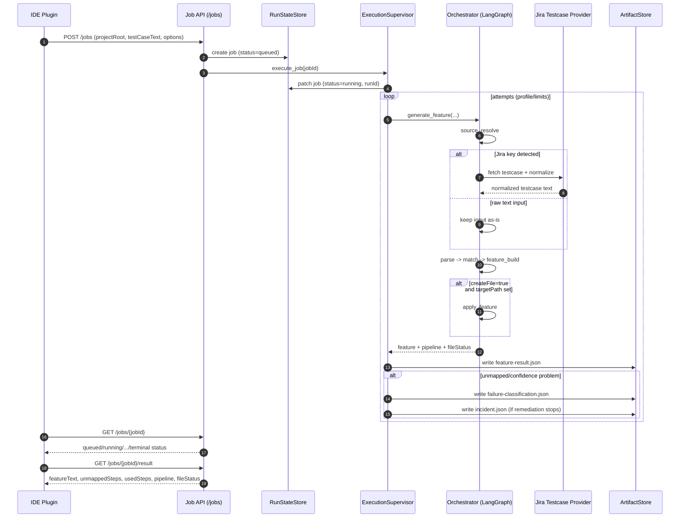

# agent-service

`agent-service` is a FastAPI backend for the Sber IDE plugin.

## Architecture

```text
Sber IDE Plugin
  -> agent-service (FastAPI, /api/v1/*)
    -> LangGraph workflows
      -> LangChain tools + local stores (steps index, memory, learning)
```

## Autotest Generation Pipeline (Jobs-first)

The IntelliJ plugin uses a jobs-first flow for autotest generation:
`POST /jobs` -> polling `GET /jobs/{jobId}` -> final `GET /jobs/{jobId}/result`.



### Pipeline Stages and Statuses

| Stage | Source in response | Typical status | Details |
| --- | --- | --- | --- |
| `source_resolve` | `feature.pipeline[].stage` | `raw_text`, `jira_live`, `jira_stub_fixed` | Detects Jira testcase keys and resolves source text. |
| `parse` | `feature.pipeline[].stage` | `ok` | Parses testcase text into structured scenario. |
| `match` | `feature.pipeline[].stage` | `ok`, `needs_scan` | Matches scenario steps against indexed project steps. |
| `feature_build` | `feature.pipeline[].stage` | `feature_built` (from `buildStage`) | Builds rendered `.feature`, summary and metadata. |

### Job Lifecycle

- `queued` -> `running` -> `succeeded | needs_attention | cancelled`
- Cancellation may pass through `cancelling`.
- `failed` is usually attempt-level; job-level terminal state is typically `needs_attention`.
- If a result is not ready, `GET /jobs/{jobId}/result` returns `409`.

### Prerequisite for High-Quality Matching

- Run `POST /steps/scan-steps` before generation to populate the step index.
- The jobs pipeline does not run scan automatically.
- If index is missing, the `match` stage can return `needs_scan`, and `unmapped` count is usually higher.

### API Sequence (Minimal Example)

```powershell
# 1) Create job
curl -X POST http://127.0.0.1:8000/api/v1/jobs `
  -H "Content-Type: application/json" `
  -d "{\"projectRoot\":\"C:/work/project\",\"testCaseText\":\"Given ...\",\"source\":\"ide-plugin\"}"

# 2) Poll status
curl http://127.0.0.1:8000/api/v1/jobs/{jobId}

# 3) Fetch final result
curl http://127.0.0.1:8000/api/v1/jobs/{jobId}/result
```

The final payload in `/jobs/{jobId}/result` includes:
`featureText`, `unmappedSteps`, `unmapped`, `usedSteps`, `buildStage`, `stepsSummary`, `meta`, `pipeline`, `fileStatus`.

### Legacy Synchronous Endpoint

- `POST /feature/generate-feature` is still available for direct generation.
- The default plugin path is jobs-first (`/jobs`) because it provides lifecycle, attempts and artifacts.

## Core Flows

- `POST /steps/scan-steps`
  - Scans project sources and updates Cucumber step index.
- `GET /steps?projectRoot=...`
  - Reads indexed steps.
- `POST /jobs`
  - Starts jobs-first feature generation pipeline:
  - parse testcase -> find/match indexed steps -> build feature -> optional apply.
  - The jobs pipeline does not run step scan.
- `GET /jobs/{jobId}` / `GET /jobs/{jobId}/result` / `GET /jobs/{jobId}/events`
  - Job lifecycle and result retrieval.
- `POST /chat/sessions` and related `/chat/*`
  - Chat control-plane compatible API backed by local LangGraph runtime.
- `POST /memory/feedback`
  - Records project-level feedback to improve future step ranking.
- `POST /tools/find-steps`, `POST /tools/compose-autotest`, `POST /tools/explain-unmapped`
  - Skill/tool endpoints for step retrieval, autotest composition and unmatched analysis.

## Requirements

- Python `3.10+`

## Install

```powershell
python -m venv .venv
.\.venv\Scripts\Activate.ps1
python -m pip install --upgrade pip setuptools
python -m pip install -e .
```

## Run

```powershell
agent-service
```

Alternative:

```powershell
$env:PYTHONPATH="src"
python -m app.main
```

## Health

```powershell
curl http://localhost:8000/health
```

## Main Config

- `AGENT_SERVICE_API_PREFIX` (default `/api/v1`)
- `AGENT_SERVICE_HOST` (default `127.0.0.1`)
- `AGENT_SERVICE_PORT` (default `8000`)
- `AGENT_SERVICE_STEPS_INDEX_DIR` (default `.agent/steps_index`)
- `AGENT_SERVICE_ARTIFACTS_DIR` (default `.agent/artifacts`)
- `AGENT_SERVICE_JIRA_SOURCE_MODE` (default `stub`, available: `stub|live|disabled`)
- `AGENT_SERVICE_JIRA_DEFAULT_INSTANCE` (default `https://jira.sberbank.ru`)
- `AGENT_SERVICE_JIRA_REQUEST_TIMEOUT_S` (default `20`)
- `AGENT_SERVICE_JIRA_VERIFY_SSL` (default `true`)
- `AGENT_SERVICE_JIRA_CA_BUNDLE_FILE` (optional custom CA bundle path for Jira TLS)
- `GIGACHAT_VERIFY_SSL` (default `true`)
- `AGENT_SERVICE_CORP_MODE` (default `false`)
- `AGENT_SERVICE_CORP_PROXY_HOST` (no default, required when corp mode is enabled)
- `AGENT_SERVICE_CORP_PROXY_PATH` (default `/sbe-ai-pdlc-integration-code-generator/v1/chat/proxy/completions`)
- `AGENT_SERVICE_CORP_MODEL` (default `GigaChat-2-Max`)
- `AGENT_SERVICE_CORP_CERT_FILE` / `AGENT_SERVICE_CORP_KEY_FILE` (required when corp mode is enabled)
- `AGENT_SERVICE_CORP_CA_BUNDLE_FILE` (optional custom CA bundle path)
- `AGENT_SERVICE_CORP_REQUEST_TIMEOUT_S` (default `30`)

## Corporate Proxy (mTLS)

To route chat completions through corporate proxy without storing full endpoint in code:

```powershell
$env:AGENT_SERVICE_CORP_MODE='true'
$env:AGENT_SERVICE_CORP_PROXY_HOST='https://ci09783180-ift-ai-hub-platform.apps.ift-terra000024-edm.ocp.delta.sbrf.ru'
$env:AGENT_SERVICE_CORP_CERT_FILE='C:\\certs\\client.crt'
$env:AGENT_SERVICE_CORP_KEY_FILE='C:\\certs\\client.key'
```

Service will call:
`{AGENT_SERVICE_CORP_PROXY_HOST}/sbe-ai-pdlc-integration-code-generator/v1/chat/proxy/completions`

In this mode, chat uses `AGENT_SERVICE_CORP_MODEL` (default `GigaChat-2-Max`) and does not require `GIGACHAT_CLIENT_ID/GIGACHAT_CLIENT_SECRET`.

## SSL Troubleshooting (Corporate Certificates)

If Jira testcase retrieval fails with `CERTIFICATE_VERIFY_FAILED` and your network uses TLS interception,
you can disable SSL verification for local development:

```powershell
$env:AGENT_SERVICE_JIRA_VERIFY_SSL='false'
```

Safer alternative for local/corporate setup:

```powershell
$env:AGENT_SERVICE_JIRA_VERIFY_SSL='true'
$env:AGENT_SERVICE_JIRA_CA_BUNDLE_FILE='C:\\certs\\corp-ca.pem'
```

If chat requests fail with `CERTIFICATE_VERIFY_FAILED`, you can disable SSL verification for local development:

```powershell
$env:GIGACHAT_VERIFY_SSL='false'
```

Disabling verification is less secure and should be used only in trusted local environments.

## Verification

```powershell
$env:PYTHONDONTWRITEBYTECODE='1'
python -m pytest -p no:cacheprovider tests/test_chat_api.py tests/test_jobs_api.py
```
