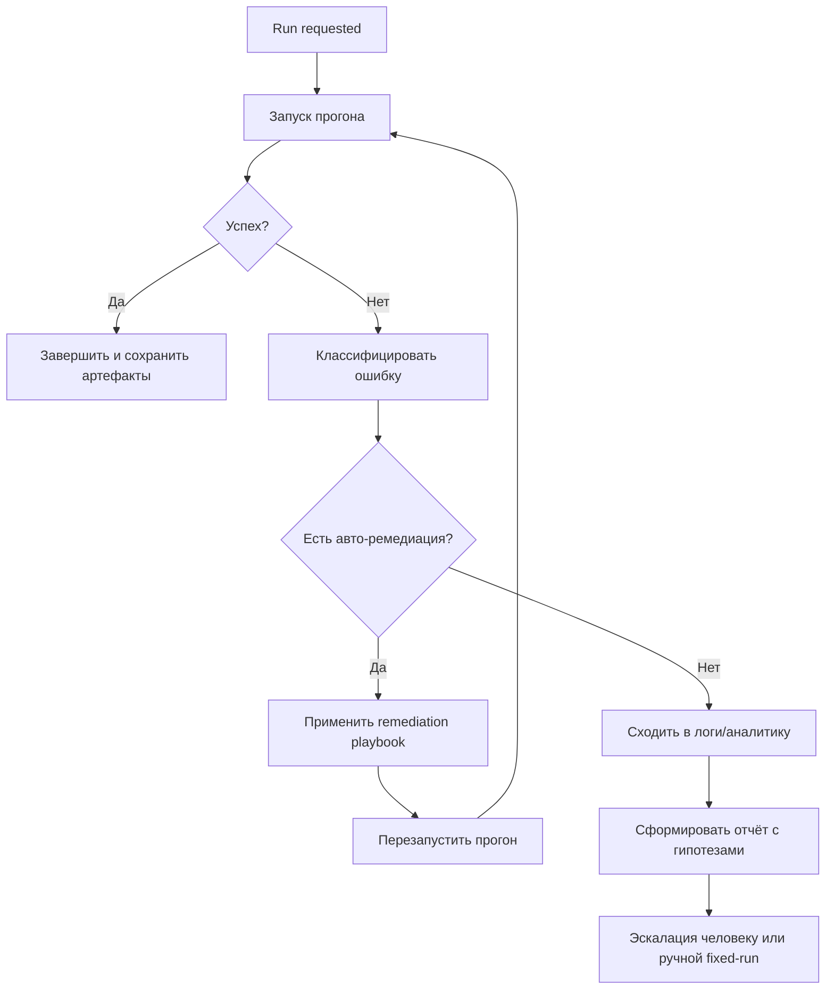

# Как применить архитектурные принципы OpenClaw в `agent-service`

Ниже — творческий, но реалистичный план, как перенести сильные стороны OpenClaw в наш FastAPI + LangGraph сервис.

## 1) Целевое направление: от «набора endpoints» к «control plane для BDD-автоматизации»

Сейчас `agent-service` уже имеет сильный базис: API-слой, оркестратор, агенты и инфраструктурные адаптеры.
Следующий шаг — сделать из него платформу, где любой вход (IDE-плагин, CLI, CI, webhook) проходит через единый контур и использует общий pipeline, состояние и политики.

### Что это даст

- одинаковое поведение из IDE, CLI и CI;
- переиспользование одного и того же графа агентов;
- проще масштабировать новые сценарии (например, автогенерация тестов из Jira/Confluence);
- проще наблюдать и дебажить весь pipeline.

---

## 2) Предлагаемая целевая архитектура для нашего проекта

```mermaid
flowchart LR
    subgraph Inbound[Входы]
      IDE[IDE plugin]
      CLI[CLI утилита]
      CI[CI webhook]
      API[HTTP API]
    end

    subgraph ControlPlane[Agent Control Plane]
      GW[Unified Gateway Layer]
      AUTH[Auth/Quota/Rate-limit]
      ROUTE[Routing + Job API]
      EVENTS[Event Bus + Progress stream]
    end

    subgraph DomainRuntime[Domain Runtime]
      ORCH[LangGraph Orchestrator]
      AGENTS[RepoScanner/TestcaseParser/StepMatcher/FeatureBuilder]
      POLICIES[Policy Engine (fallback, retries, quality gates)]
      REG[Registry capability-модулей]
    end

    subgraph Data[Stores]
      STEPIDX[StepIndexStore]
      EMB[EmbeddingsStore]
      RUNS[RunStateStore]
      ART[ArtifactStore .feature / reports]
    end

    IDE --> GW
    CLI --> GW
    CI --> GW
    API --> GW

    GW --> AUTH --> ROUTE --> ORCH
    ROUTE --> EVENTS
    ORCH --> AGENTS --> POLICIES
    AGENTS --> REG

    ORCH --> STEPIDX
    ORCH --> EMB
    ORCH --> RUNS
    ORCH --> ART
```

---

## 3) Конкретные идеи, которые можно внедрять поэтапно

## Этап A — Unified Gateway Layer (по аналогии control plane)

### Идея
Сделать тонкий слой над текущими роутами FastAPI: единый вход в задачи генерации, сканирования и сопоставления.

### Практически

1. Ввести `Job API`:
   - `POST /jobs` — создать задачу (scan/match/generate/apply);
   - `GET /jobs/{id}` — статус и метаданные;
   - `GET /jobs/{id}/events` — поток прогресса (SSE/WebSocket).
2. В текущие endpoints добавить совместимость, но внутри проксировать в `Job API`.
3. Выделить `RunContext` (projectRoot, source, correlationId, llmProfile, language).

### Плюс
- асинхронные длительные задачи без блокировки клиента;
- единая телеметрия и трассировка исполнения.

## Этап B — Capability registry вместо жёсткой связки

### Идея
Сделать реестр «возможностей» как в OpenClaw plugins/skills: каждый capability объявляет контракт и обработчик.

### Практически

- `scan_steps`, `parse_testcase`, `match_steps`, `build_feature`, `apply_feature` становятся capability.
- Оркестратор собирает pipeline из capability по профилю сценария (например, `quick`, `strict`, `ci`).
- Добавить extension-point для кастомного постпроцессинга Gherkin (проектные конвенции).

### Плюс
- новая функциональность подключается как модуль, а не переписывает core.

## Этап C — Policy engine (качество и устойчивость)

### Идея
Вынести правила fallback/quality gates в отдельный слой.

### Практически

- Политики качества:
  - минимальный coverage сопоставления шагов;
  - запрет на «пустые» Then;
  - проверка на дубликаты/конфликты шагов.
- Политики устойчивости:
  - retry для LLM-вызовов;
  - graceful degradation при недоступном LLM;
  - переключение стратегий matching (lexical → semantic → hybrid).

### Плюс
- предсказуемость результата и меньше «магии» внутри агентов.

## Этап D — Event bus + observability-first

### Идея
Сделать события первого класса: каждый шаг графа публикует события состояния.

### Практически

- События: `job.started`, `agent.started`, `agent.completed`, `quality.failed`, `feature.generated`.
- Метрики: latency по агентам, hit-rate semantic matching, доля fallback-run.
- Структурные логи с `jobId` и `projectRootHash`.

### Плюс
- легко объяснять «почему получили именно такой .feature»;
- проще мониторить деградации качества после изменений.

## Этап E — Multi-client mode (IDE + CI + batch)

### Идея
Повторить принцип «много каналов, одно ядро»: IDE и CI используют единый runtime.

### Практически

- CLI-обёртка для CI (`agent-service jobs submit ...`).
- Webhook endpoint для внешних систем (Jira/ALM) → создаёт job в том же пайплайне.
- Batch режим для миграции legacy тесткейсов в feature-файлы.

### Плюс
- agent-service становится платформой, а не только backend для плагина.

---

## 4) Предложенный roadmap внедрения

1. **Sprint 1:** Job API + RunStateStore + SSE событий.
2. **Sprint 2:** Capability registry + миграция текущих 4 агентов на контракты capability.
3. **Sprint 3:** Policy engine + quality gates + отчёт причин fallback.
4. **Sprint 4:** CLI/CI интеграция + batch режим + метрики/дашборд.

---

## 5) Риски и как их снизить

- **Риск:** усложнение архитектуры раньше времени.  
  **Снижение:** идти через anti-corruption layer, сохраняя текущие endpoints совместимыми.

- **Риск:** рост операционной сложности.  
  **Снижение:** минимальный стек observability на старте (JSON logs + базовые метрики).

- **Риск:** нестабильность LLM-части.  
  **Снижение:** явные policy-переходы и deterministic fallback без LLM.

---

## 6) Что можно начать делать прямо сейчас (короткий список)

1. Добавить `job_id` и корреляцию во все текущие роуты и логирование.
2. Вынести единый объект `RunContext` в оркестратор и агентов.
3. Добавить протокол событий оркестратора (пока хотя бы in-memory).
4. Формализовать quality-gate перед возвратом `.feature` в API.

Если пойдём этим путём, мы получим «openclaw-подобную» гибкость (единая control plane + расширяемые capability), но в домене BDD-генерации и сопоставления шагов.


---

## 7) Autonomic loop: «запустить → диагностировать → отладить → перезапустить»

Твоя цель (как у OpenClaw по расширяемости) — чтобы система сама вела инцидент до результата. Для этого нужен **замкнутый контур исполнения и диагностики**:



### 7.1 Новые capability, которые стоит добавить

- `run_test_execution` — запускает прогон (через локальный runner/CI API).
- `collect_run_artifacts` — собирает stdout/stderr, отчёты, stacktrace, скриншоты, ссылки на CI job.
- `classify_failure` — определяет тип сбоя: infra/flaky/assertion/data/env/timeout/locator и т.д.
- `apply_remediation` — применяет безопасные playbook-действия (повтор, очистка state, прогрев, reset test data).
- `rerun_with_strategy` — повторный запуск с выбранной стратегией (same-config, isolated, verbose, debug).
- `incident_report_builder` — краткая RCA-выжимка: симптомы, что пробовали, что помогло/не помогло.

### 7.2 Failure taxonomy (почему это важно)

Если не формализовать типы ошибок, система не сможет стабильно «дебажить сама себя».
Минимальная таксономия:

1. **Infrastructure:** недоступен сервис, сеть, CI executor, 5xx.
2. **Environment/config:** неверные секреты, конфиг, версия зависимостей.
3. **Data:** тестовые данные отсутствуют/протухли.
4. **Flaky/timing:** race condition, нестабильный timeout.
5. **Product/assertion:** реальный дефект продукта.
6. **Automation/framework:** ошибка шага, селектора, степ-дефинишена.

Для каждого класса — свой remediation playbook и лимиты авто-повторов.

### 7.3 Observability и аналитика как часть основного потока

Чтобы система «шла в сервис логов и аналитику», закладываем это в runtime:

- Correlation IDs: `jobId`, `runId`, `attemptId`, `testCaseId` во всех логах.
- Structured logs + OpenTelemetry trace/span для агентов и external calls.
- Error events в event bus: `run.failed`, `failure.classified`, `remediation.applied`, `rerun.scheduled`.
- Интеграции:
  - лог-хранилище (например, ELK/Loki);
  - метрики (Prometheus/Grafana);
  - ошибки (Sentry/аналог).

### 7.4 Guardrails, чтобы автодебаг был безопасным

- Лимит числа авто-перезапусков на job (например, не более 2-3).
- Idempotent remediation (никаких опасных мутаций прод-окружения).
- Policy allowlist на доступные автоматические действия.
- Чёткие stop conditions: после N неуспешных попыток — автоматическая эскалация.

### 7.5 Как встроить в наш текущий стек FastAPI + LangGraph

- Добавить в граф новую ветку после шага генерации/матчинга: `ExecutionSupervisorAgent`.
- Вынести перезапуски в `RunCoordinator` (state machine), чтобы избежать хаотичных retry.
- Хранить историю попыток в `RunStateStore` + артефакты в `ArtifactStore`.
- Отдавать в IDE плагин живой статус «что делает система сейчас» через SSE/WebSocket.

### 7.6 Обновление roadmap с учётом autonomic loop

1. **Sprint 1:** Job API + RunStateStore + SSE.
2. **Sprint 2:** Capability registry + contracts для текущих агентов.
3. **Sprint 3:** Policy engine + quality gates + failure taxonomy.
4. **Sprint 4:** ExecutionSupervisor + remediation playbooks + controlled rerun.
5. **Sprint 5:** Интеграции логов/метрик/ошибок + incident reports + dashboard SRE/QA.
